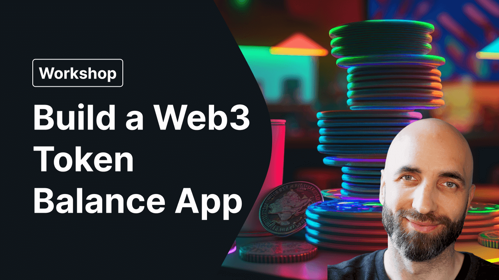

# Token Balance app using QuickNode Token and NFT API v2 bundle

This app is a simple example of how to use the QuickNode Token and NFT API v2 bundle to display token balances for a given address, along with transaction history for each token.

Sign up for QuickNode free account: https://www.quicknode.com

## QuickNode Token and NFT API v2 bundle

The QuickNode Token and NFT API v2 bundle is a collection of APIs that allow you to query token and NFT balances, transactions, and other information for a given address.

You need to add the Token and NFT API v2 bundle to your QuickNode account as an add-on to be able to use it.

Details and documentation: https://marketplace.quicknode.com/add-on/token-and-nft-api-v2-bundle

## Try it out

You can try out the app here: https://showmethetokens.xyz/

## Watch me build it

I built this app live on YouTube. You can watch the video here:

